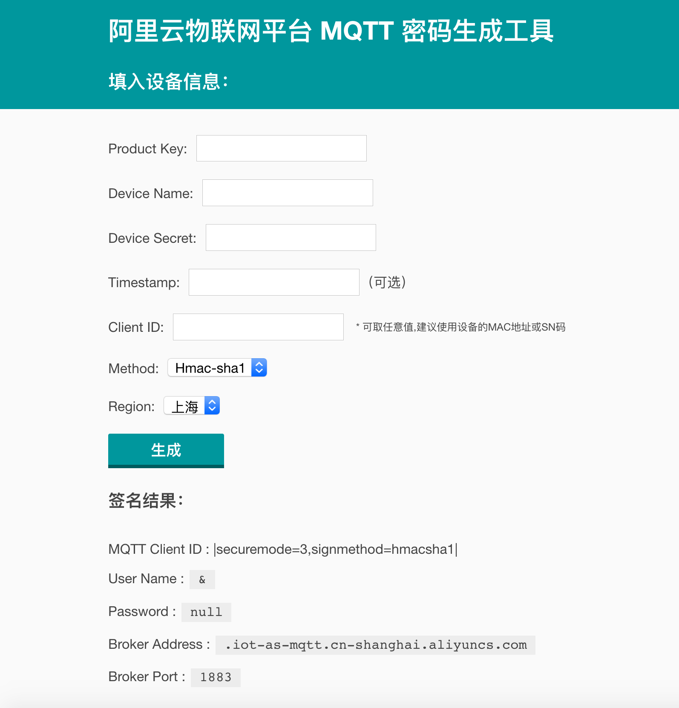

# 阿里云物联网平台 MQTT 密码生成工具

## CLI Commands

``` bash
# install dependencies
npm install

# serve with hot reload at localhost:8080
npm run dev

# build for production with minification
npm run build

# test the production build locally
npm run serve

# run tests with jest and preact-render-spy 
npm run test
```


界面 :


